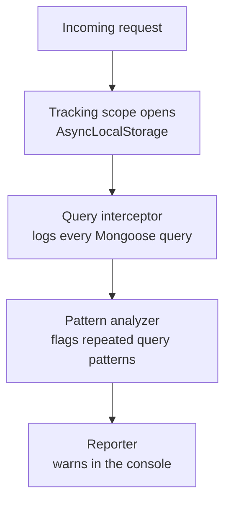

<div align="center">


<a href="https://git.io/typing-svg">
  
</a>

<br/>


=18"/>


<p><strong>A zero-runtime-dependency Node.js + TypeScript library that catches N+1 query
patterns in Mongoose applications before they reach production.</strong></p>
<p>Inspired by Ruby on Rails' <code>Bullet</code> gem — built for an ecosystem that never had one.</p>

</div>

<br/>

## Table of contents

- [The problem](#the-problem)
- [What Mongoosleuth does about it](#what-mongoosleuth-does-about-it)
- [Installation](#installation)
- [Usage](#usage)
- [How it works](#how-it-works)
- [Technical details: the fingerprinting system](#technical-details-the-fingerprinting-system)
- [Development scripts](#development-scripts)
- [Non-negotiable principles](#non-negotiable-principles)
- [Roadmap](#roadmap)
- [License](#license)

<br/>

## The problem

```ts
// Looks completely fine. Isn't.
const posts = await Post.find();

for (const post of posts) {
  // One extra query. Per post. Every single time this route is hit.
  post.author = await User.findById(post.authorId);
}
```

Fifty posts. Fifty-one queries. The response still comes back. Nobody notices —
until the collection grows, the route gets popular, and the database starts
spending more time on this one endpoint than on everything else combined.

This is the N+1 query problem, and in the Ruby on Rails world it has had a
well-known solution for over a decade: the `Bullet` gem watches your queries
in development and tells you exactly where you went wrong. Mongoose has never
had an equivalent. Mongoosleuth is that equivalent.

## What Mongoosleuth does about it

It watches the same code, says nothing while everything is fine, and the
moment that loop fires the same query shape more times than your threshold
allows in a single request, it tells you exactly where to look:

```
[mongoosleuth] N+1 detected
  model: User
  query: findById(<value>)
  called 50 times in routes/posts.ts:14
  fix: use .populate('author') or User.find({ _id: { $in: [...] } })
```

No raw values are ever logged — only field names and value _types_ — so this
is safe to leave running against a database full of real, sensitive, user data.

## Installation

```bash
npm install mongoosleuth
```

`mongoose` is a peer dependency, not a regular dependency — make sure it is
already installed in your project.

## Usage

### Express / Fastify / Koa middleware

```typescript
import mongoose from 'mongoose';
import { Mongoosleuth } from 'mongoosleuth';

const sleuth = new Mongoosleuth({
  enabled: process.env.NODE_ENV !== 'production',
  threshold: 3,
});

// Patch Mongoose's query execution once, at startup.
sleuth.attach(mongoose);

// Open a tracking scope for every incoming request.
app.use(sleuth.middleware());
```

### Manual scope (background jobs, scripts, anything without HTTP)

```typescript
await sleuth.run(async () => {
  const users = await User.find({ status: 'active' });

  for (const user of users) {
    // Tracked and analyzed exactly like a request — fires the same warning
    // if this turns out to be a loop instead of a batched query.
    const profile = await Profile.findOne({ userId: user.id });
  }
});
```

## How it works



Each request gets its own isolated tracking scope. Every query fired inside
that scope is fingerprinted and logged. When the request finishes, the
analyzer checks whether any fingerprint repeated, from the same line of code,
often enough to be a loop rather than a coincidence — and if so, the reporter
prints it.

## Technical details: the fingerprinting system

At the core of the detector is a deterministic fingerprinting function
(`src/fingerprint.ts`) that identifies _the shape_ of a query without ever
touching the actual data inside it.

**1. Normalization.** Every primitive value inside a query filter is replaced
with a tag representing its type, never its value:

| Value type  | Normalized to |
| ----------- | ------------- |
| `string`    | `<string>`    |
| `number`    | `<number>`    |
| `boolean`   | `<boolean>`   |
| `Date`      | `<Date>`      |
| `ObjectId`  | `<ObjectId>`  |
| `RegExp`    | `<RegExp>`    |
| `null`      | `<null>`      |
| `undefined` | `<undefined>` |

MongoDB query operators such as `$gt`, `$in`, or `$regex` are preserved as
part of the shape — they change what the query means, so they are never
collapsed away. Arrays are normalized using the shape of their first element
only; an empty array is tagged `<empty array>`.

**2. Deterministic key sorting.** Object keys are sorted alphabetically at
every nesting level before the fingerprint is built, so field order in your
code never affects detection:

```
{ name: "John", age: 30 } → { age: <number>, name: <string> }
{ age: 30, name: "John" } → { age: <number>, name: <string> }
```

Same fingerprint either way — which is exactly the point.

## Development scripts

| Command          | What it does                                                                |
| ---------------- | --------------------------------------------------------------------------- |
| `npm run build`  | Builds dual ESM (`.mjs`) and CommonJS (`.js`) output, plus `.d.ts`/`.d.mts` |
| `npm test`       | Runs the unit and integration suite (Vitest + `mongodb-memory-server`)      |
| `npm run lint`   | Checks code style and TypeScript linter compliance                          |
| `npm run format` | Formats the codebase with Prettier                                          |

## Non-negotiable principles

> Zero runtime dependencies. `mongoose` is a peer dependency, never a
> dependency.
>
> Privacy first. Raw query values are never logged — only field names and
> value type tags.
>
> No shared state. Every request is isolated through `AsyncLocalStorage`; two
> concurrent requests never see each other's query logs.
>
> Dual module output. Full support for ESM and CommonJS consumers, with
> accurate `.d.ts` definitions for both.

## Roadmap

- **Unused eager loading detection** — flagging a `.populate()` call whose
  result was never actually read, the mirror image of the N+1 problem.
- **Custom reporters** — first-class examples for shipping findings to
  Slack, Sentry, or a structured log pipeline instead of the console.

## License

MIT

<div align="center">

</div>
